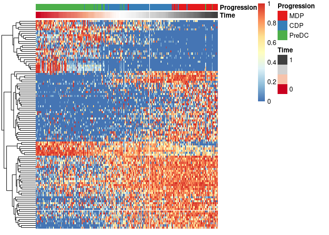
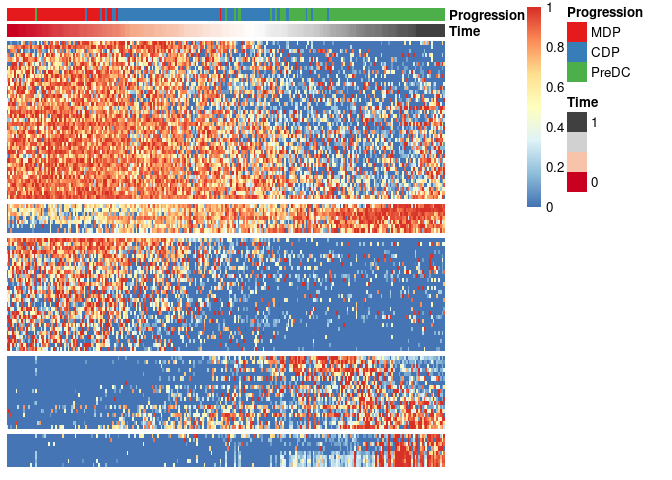

# SCORPIUS

[](https://travis-ci.org/rcannood/SCORPIUS)
[](https://ci.appveyor.com/project/rcannood/SCORPIUS)
[](https://cran.r-project.org/package=SCORPIUS)
[](https://codecov.io/gh/rcannood/SCORPIUS?branch=master)

**SCORPIUS an unsupervised approach for inferring developmental
chronologies from single-cell RNA sequencing data.** In comparison to
similar approaches, it has three main advantages:

  - **It accurately reconstructs linear dynamic processes.** The
    performance was evaluated using a quantitative evaluation pipeline
    and ten single-cell RNA sequencing datasets.

  - **It automatically identifies marker genes, speeding up knowledge
    discovery.**

  - **It is fully unsupervised.** Prior knowledge of the relevant marker
    genes or cellular states of individual cells is not required.

News:

  - See `news(package = "SCORPIUS")` for a full list of changes to the
    package.

  - A preprint is available on
    [bioRxiv](http://biorxiv.org/content/early/2016/10/07/079509). Run
    `citation("SCORPIUS")` to obtain the corresponding citation
    information.

  - Check out our
    [review](https://www.biorxiv.org/content/early/2018/03/05/276907) on
    Trajectory Inference methods\!

## Installing SCORPIUS

You can install:

  - the latest released version from CRAN with
    
    ``` r
    install.packages("SCORPIUS")
    ```

  - the latest development version from github
    with
    
    ``` r
    devtools::install_github("rcannood/SCORPIUS", build_vignettes = TRUE)
    ```

If you encounter a bug, please file a minimal reproducible example on
the [issues](https://github.com/rcannood/SCORPIUS/issues) page.

## Learning SCORPIUS

To get started, read the introductory example below, or read one of the
vignettes containing more elaborate examples:

  - [Investigating differentiating dendritic cell
    progenitors](vignettes/ginhoux.md): `vignette("ginhoux",
    package="SCORPIUS")`
  - [Inferring trajectories from simulated
    data](vignettes/simulated-data.md): `vignette("simulated-data",
    package="SCORPIUS")`

## Introductory example

This section describes the main workflow of SCORPIUS without going in
depth in the R code. For a more detailed explanation, see the vignettes
listed below.

To start using SCORPIUS, simply write:

``` r
library(SCORPIUS)
```

The `ginhoux` dataset (See Schlitzer et al. 2015) contains 248 dendritic
cell progenitors in one of three cellular cellular states: MDP, CDP or
PreDC. Note that this is a reduced version of the dataset, for packaging
reasons. See ?ginhoux for more info.

``` r
data(ginhoux)
expression <- ginhoux$expression
group_name <- ginhoux$sample_info$group_name
```

With the following code, SCORPIUS reduces the dimensionality of the
dataset and provides a visual overview of the dataset. In this plot,
cells that are similar in terms of expression values will be placed
closer together than cells with dissimilar expression values.

``` r
space <- reduce_dimensionality(expression, "spearman")
draw_trajectory_plot(space, group_name, contour = TRUE)
```

<!-- -->

To infer and visualise a trajectory through these cells, run:

``` r
traj <- infer_trajectory(space)
draw_trajectory_plot(space, group_name, traj$path, contour = TRUE)
```

<!-- -->

To identify candidate marker genes,
run:

``` r
# warning: setting num_permutations to 10 requires a long time (~30min) to run!
# set it to 0 and define a manual cutoff for the genes (e.g. top 200) for a much shorter execution time.
gimp <- gene_importances(
  expression, 
  traj$time, 
  num_permutations = 10, 
  num_threads = 8, 
  ntree = 10000,
  ntree_perm = 1000
) 
```

To select the most important genes and scale its expession, run:

``` r
gimp$qvalue <- p.adjust(gimp$pvalue, "BH", length(gimp$pvalue))
gene_sel <- gimp$gene[gimp$qvalue < .05]
expr_sel <- scale_quantile(expression[,gene_sel])
```

To visualise the expression of the selected genes, use the
`draw_trajectory_heatmap` function.

``` r
draw_trajectory_heatmap(expr_sel, traj$time, group_name)
```

<!-- -->

Finally, these genes can also be grouped into modules as
follows:

``` r
modules <- extract_modules(scale_quantile(expr_sel), traj$time, verbose = F)
draw_trajectory_heatmap(expr_sel, traj$time, group_name, modules)
```

<!-- -->

## Latest changes

Check out `news(package = "SCORPIUS")` or [NEWS.md](inst/NEWS.md) for a
full list of
changes.

<!-- This section gets automatically generated from inst/NEWS.md, and also generates inst/NEWS -->

### Recent changes in SCORPIUS 1.0.3 (23-05-2019)

#### Optimisation

  - `infer_trajectory()`: Use princurve’s `approx_points` parameter,
    which greatly speeds up for trajectory inference for large number of
    samples.

#### Major changes

  - Use dynutils’ `calculate_distance()` instead of
    `correlation_distance()` and `euclidean_distance()`.

#### Documentation

  - Vignettes were updated.

  - Added `cran-comments.md`.

  - Added recent news (`inst/NEWS.md`).

  - Added citation information (`inst/CITATION`).

#### Minor changes

  - Use scaling functions from dynutils (`scale_minmax()`,
    `scale_quantile()`, `scale_uniform()`).

  - Expanded unit tests.

  - Renormalise the original ginhoux data using dynnormaliser and rerun
    all vignettes.

  - Moved `cmdscale_withlandmarks()` to dyndimred.

#### Bug fixes

  - `extract_modules()`: `smooth.spline()` now requires at least 4
    unique values.

#### Deprecation

  - Deprecated unused functions `evaluate_trajectory()` and
    `evaluate_dim_red()`. Use `dyneval::evaluate_ti_method()` instead.

### Recent changes in SCORPIUS 1.0.2 (2018-06-29)

  - MINOR CHANGE: Depend on dynutils for distance functions.

  - MAJOR CHANGE `reduce_dimensionality()`: Merge
    reduce\_dimensionality\_landmarked and reduce\_dimensionality
    functions.

  - REMOVAL: Removed `outlier_filter()`; there are much better scRNA-seq
    preprocessing pipelines in existance by now.

## References

<div id="refs" class="references">

<div id="ref-Schlitzer2015">

Schlitzer, Andreas, V Sivakamasundari, Jinmiao Chen, Hermi Rizal Bin
Sumatoh, Jaring Schreuder, Josephine Lum, Benoit Malleret, et al. 2015.
“Identification of cDC1- and cDC2-committed DC progenitors reveals
early lineage priming at the common DC progenitor stage in the bone
marrow.” *Nature Immunology* 16 (7): 718–26.
<https://doi.org/10.1038/ni.3200>.

</div>

</div>
