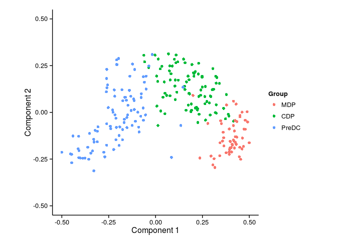
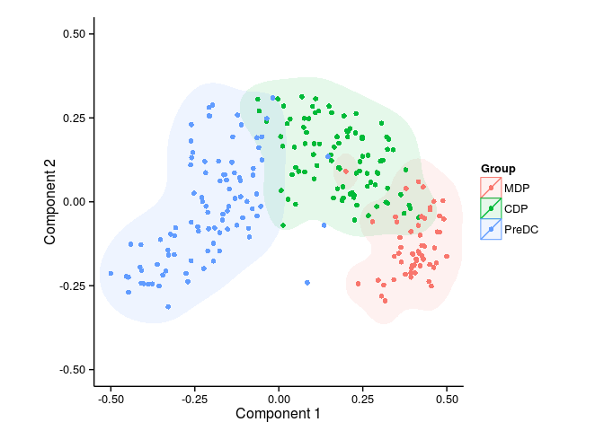
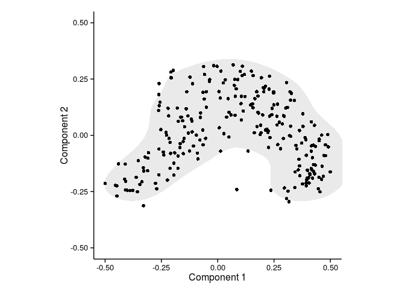
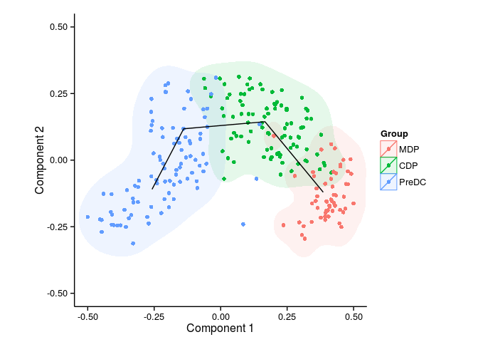
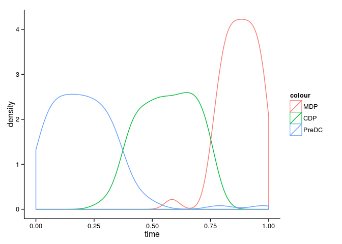
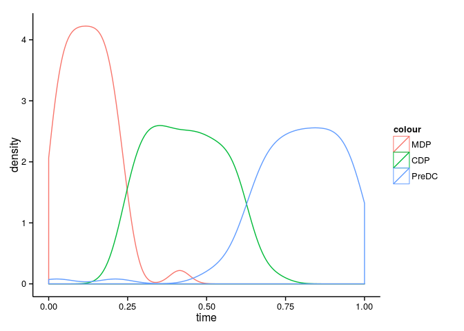
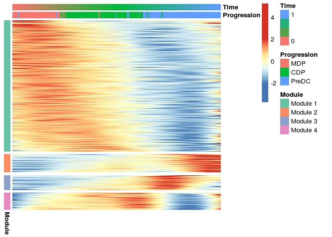
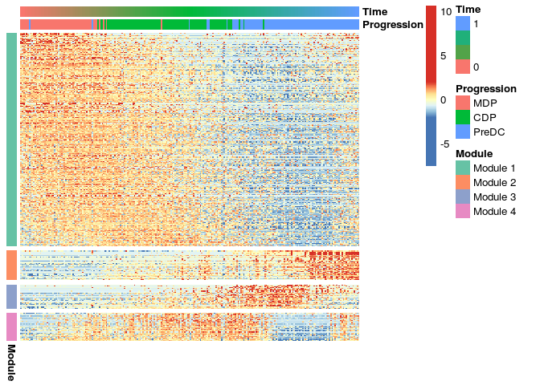

``` r
library(SCORPIUS)
```

    ## Loading required package: DBI

``` r
library(dplyr)
```

    ## 
    ## Attaching package: 'dplyr'
    ## 
    ## The following objects are masked from 'package:stats':
    ## 
    ##     filter, lag
    ## 
    ## The following objects are masked from 'package:base':
    ## 
    ##     intersect, setdiff, setequal, union

``` r
library(tidyr)
```

Loading in the data
-------------------

Load in the dataset from Schlitzer et al.

``` r
data(ginhoux.dataset)
```

This matrix contains the expression data

``` r
counts <- ginhoux.dataset$counts
dim(counts)
```

    ## [1]   248 15752

This is info pertaining the cells

``` r
sample.info <- ginhoux.dataset$sample.info
head(sample.info)
```

    ##            population
    ## SRR1558744        CDP
    ## SRR1558745        CDP
    ## SRR1558746        CDP
    ## SRR1558747        CDP
    ## SRR1558748        CDP
    ## SRR1558749        CDP

``` r
celltypes <- ginhoux.dataset$celltypes %>% mutate(i=seq_along(parent)) %>% select(-parent)
celltypes
```

    ##   population i
    ## 1        MDP 1
    ## 2        CDP 2
    ## 3      PreDC 3

We construct a vector of the progression of cells as integers and as factors

``` r
progression <- sample.info %>% left_join(celltypes, by=colnames(celltypes)[-ncol(celltypes)]) %>% .$i

levels <- celltypes %>% select(-i) %>% apply(1, paste, collapse="_")
progression.str <- factor(sample.info[,colnames(celltypes)[-ncol(celltypes)],drop=F] %>% apply(1, paste, collapse="_"), levels)

names(progression.str) <- names(progression) <- rownames(counts)
```

SCORPIUS
--------

Calculate distance

``` r
dist <- calculate.distance(counts)
```

Calculate outliers

``` r
out <- calculate.outlier(dist)
filter <- !out$is.outlier
```

Filter away outliers

``` r
counts <- counts[filter,,drop=F]
dist <- dist[filter, filter]
sample.info <- sample.info[filter,,drop=F]
progression.str <- progression.str[filter]
progression <- progression[filter]
```

Reduce dimensionality

``` r
space <- reduce.dimensionality(dist, ndim=3)
evaluate.space(space, progression)
```

    ## [1] 0.9628099

Different plotting options

``` r
plot.dimensionality.reduction(space, colour = progression.str)
```



``` r
plot.dimensionality.reduction(space, colour = progression.str, contour=T)
```



``` r
plot.dimensionality.reduction(space, colour = progression.str, contour=T)
```


``` r
plot.dimensionality.reduction(space, contour=T)
```



Infer trajectory

``` r
trajectory <- infer.trajectory(space, k=4)
evaluate.trajectory(trajectory$time, progression)
```

    ## [1] 0.9575763

Different plotting options

``` r
plot.trajectory(space, trajectory$initial.path, colour=progression.str, contour=T)
```



``` r
plot.trajectory(space, trajectory$final.path, colour=progression.str, contour=T)
```


``` r
plot.trajectory.density(trajectory$time, progression.str)
```



Reverse the trajectory if it is the wrong way around

``` r
prog.means <- tapply(trajectory$time, progression.str, mean)
if (prog.means[[last(levels)]] < prog.means[[first(levels)]]) {
  trajectory <- reverse.trajectory(trajectory)
}
time <- trajectory$time
plot.trajectory.density(trajectory$time, progression.str)
```



Find trajectory aligned genes (TAGs)

``` r
tags <- find.trajectory.aligned.genes(counts, trajectory$time, q.value.cutoff = 1e-10, mc.cores = 8)
head(tags$p.values, 20)
```

    ##             gene      p.value      q.value is.tag           category
    ## 1            Mpo 3.548964e-81 5.590328e-77   TRUE         p <= 1e-40
    ## 2          Prtn3 5.186054e-73 4.084536e-69   TRUE         p <= 1e-40
    ## 3          H2-Aa 5.005075e-61 2.627998e-57   TRUE         p <= 1e-40
    ## 4           Cd74 3.947931e-58 1.554695e-54   TRUE         p <= 1e-40
    ## 5            Cd7 5.707193e-51 1.797994e-47   TRUE         p <= 1e-40
    ## 6         H2-Ab1 1.729171e-50 4.539650e-47   TRUE         p <= 1e-40
    ## 7           Ctsg 6.163574e-49 1.386980e-45   TRUE         p <= 1e-40
    ## 8           Ly6d 6.059811e-45 1.193177e-41   TRUE         p <= 1e-40
    ## 9           Cd34 1.081554e-43 1.703663e-40   TRUE 1e-40 < p <= 1e-20
    ## 10        H2-Eb1 1.076953e-43 1.703663e-40   TRUE 1e-40 < p <= 1e-20
    ## 11          Cd93 1.289420e-37 1.846450e-34   TRUE 1e-40 < p <= 1e-20
    ## 12       Siglech 5.562703e-37 7.301975e-34   TRUE 1e-40 < p <= 1e-20
    ## 13      AK152437 2.843067e-36 3.444922e-33   TRUE 1e-40 < p <= 1e-20
    ## 14         Plbd1 1.275087e-35 1.434655e-32   TRUE 1e-40 < p <= 1e-20
    ## 15        Igfbp4 2.451044e-35 2.573923e-32   TRUE 1e-40 < p <= 1e-20
    ## 16          Cst7 3.831062e-34 3.771681e-31   TRUE 1e-40 < p <= 1e-20
    ## 17 2810417H13Rik 9.976998e-34 9.244569e-31   TRUE 1e-40 < p <= 1e-20
    ## 18        Ifitm2 9.658229e-33 8.452024e-30   TRUE 1e-40 < p <= 1e-20
    ## 19         Top2a 2.640162e-32 2.188833e-29   TRUE 1e-40 < p <= 1e-20
    ## 20           Myb 2.198175e-31 1.731283e-28   TRUE 1e-40 < p <= 1e-20

Group genes into modules

``` r
modules <- find.modules(tags$smooth.expression, tags$genes)
```

    ##  ..done.
    ##  mergeCloseModules: Merging modules whose distance is less than 0.3
    ##    Calculating new MEs...

``` r
plot.modules.heatmap(tags$smooth.expression, tags$genes, progression.str, time, modules)
```



``` r
plot.modules.heatmap(counts, tags$genes, progression.str, time, modules)
```


