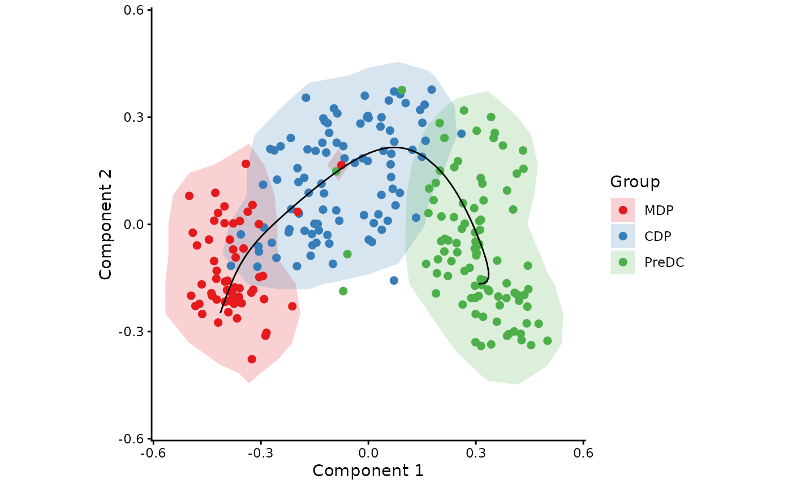
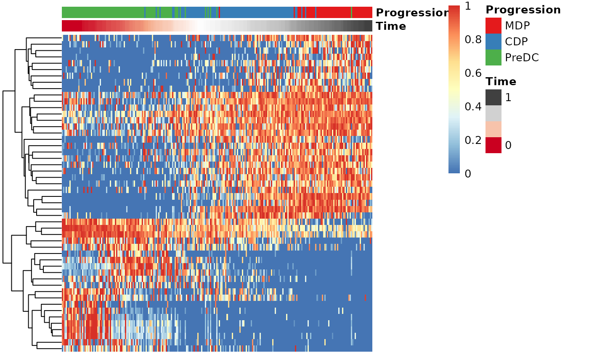
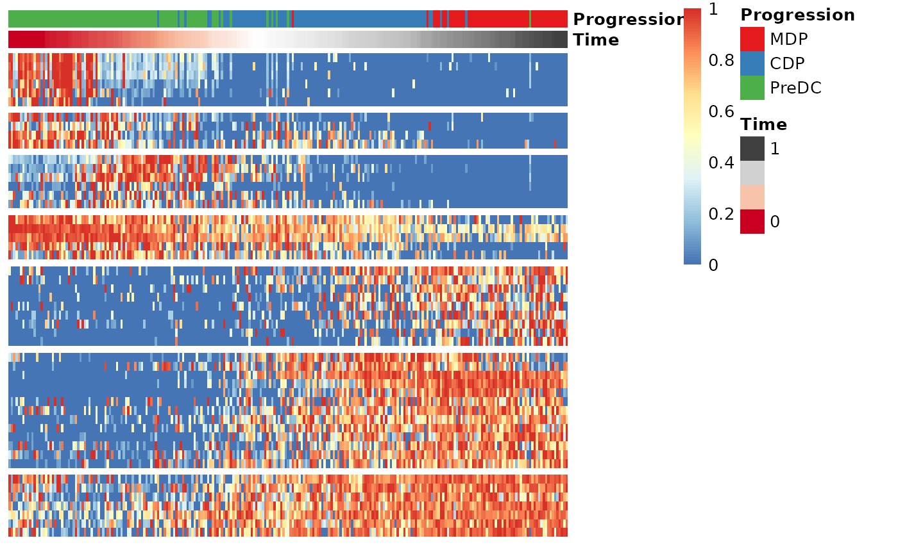

# Running SCORPIUS on a SingleCellExperiment object

This vignette assumes that you have a SingleCellExperiment object at the
ready. As an example, we create one from the `ginhoux` dataset
containing 248 dendritic cell progenitors.

``` r
library(SCORPIUS)
library(SingleCellExperiment)

data(ginhoux)

sce <- SingleCellExperiment(
  assays = list(counts = t(ginhoux$expression)),
  colData = ginhoux$sample_info
)

# short hand notation
group_name <- colData(sce)$group_name

sce
```

    ## class: SingleCellExperiment 
    ## dim: 2000 245 
    ## metadata(0):
    ## assays(1): counts
    ## rownames(2000): Mpo DQ688647 ... Clcf1 Pip5k1c
    ## rowData names(0):
    ## colnames(245): SRR1558744 SRR1558745 ... SRR1558993 SRR1558994
    ## colData names(1): group_name
    ## reducedDimNames(0):
    ## mainExpName: NULL
    ## altExpNames(0):

## Reduce dimensionality of the dataset

``` r
space <- reduce_dimensionality(t(assay(sce, "counts")), dist = "spearman", ndim = 3)
```

The new space is a matrix that can be visualised with or without
colouring of the different cell types.

``` r
draw_trajectory_plot(
  space,
  progression_group = group_name, 
  contour = TRUE
)
```

    ## Warning: `aes_string()` was deprecated in ggplot2 3.0.0.
    ## ℹ Please use tidy evaluation idioms with `aes()`.
    ## ℹ See also `vignette("ggplot2-in-packages")` for more information.
    ## ℹ The deprecated feature was likely used in the SCORPIUS package.
    ##   Please report the issue at <https://github.com/rcannood/SCORPIUS/issues>.
    ## This warning is displayed once every 8 hours.
    ## Call `lifecycle::last_lifecycle_warnings()` to see where this warning was
    ## generated.


## Inferring a trajectory through the cells

``` r
traj <- infer_trajectory(space)
```

The result is a list containing the final trajectory `path` and the
inferred timeline for each sample `time`.

``` r
draw_trajectory_plot(
  space, 
  progression_group = group_name,
  path = traj$path,
  contour = TRUE
)
```

    ## Warning: Using `size` aesthetic for lines was deprecated in ggplot2 3.4.0.
    ## ℹ Please use `linewidth` instead.
    ## ℹ The deprecated feature was likely used in the SCORPIUS package.
    ##   Please report the issue at <https://github.com/rcannood/SCORPIUS/issues>.
    ## This warning is displayed once every 8 hours.
    ## Call `lifecycle::last_lifecycle_warnings()` to see where this warning was
    ## generated.



## Finding candidate marker genes

``` r
gimp <- gene_importances(
  t(assay(sce, "counts")),
  traj$time,
  num_permutations = 0,
  num_threads = 8
)
gene_sel <- gimp[1:50,]
expr_sel <- t(assay(sce, "counts"))[,gene_sel$gene]
```

To visualise the expression of the selected genes, use the
`draw_trajectory_heatmap` function.

``` r
draw_trajectory_heatmap(expr_sel, traj$time, group_name)
```



Finally, these genes can also be grouped into modules as follows:

``` r
modules <- extract_modules(scale_quantile(expr_sel), traj$time, verbose = FALSE)
draw_trajectory_heatmap(expr_sel, traj$time, group_name, modules)
```



## Store outputs in SingleCellExperiment

``` r
reducedDims(sce) <- SimpleList(MDS = space)
colData(sce)$trajectory_path <- traj$path
colData(sce)$trajectory_pseudotime <- traj$time
rowData(sce)$trajectory_importance <- gimp[match(rownames(sce), gimp$gene),]$importance

sce
```

    ## class: SingleCellExperiment 
    ## dim: 2000 245 
    ## metadata(0):
    ## assays(1): counts
    ## rownames(2000): Mpo DQ688647 ... Clcf1 Pip5k1c
    ## rowData names(1): trajectory_importance
    ## colnames(245): SRR1558744 SRR1558745 ... SRR1558993 SRR1558994
    ## colData names(3): group_name trajectory_path trajectory_pseudotime
    ## reducedDimNames(1): MDS
    ## mainExpName: NULL
    ## altExpNames(0):
