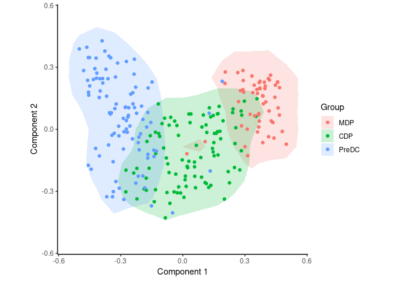

Investigating dendritic cell maturation in dendritic cell progenitors
================
Robrecht Cannoodt
2016-01-22

<!-- github markdown built using 
rmarkdown::render("vignettes/ginhoux.Rmd", output_format = "github_document")
-->
In this vignette, SCORPIUS is used to infer a trajectory through dendritic cell progenitors. The `ginhoux` dataset contains 248 dendritic cell progenitors in one of three cellular cellular states: MDP, CDP or PreDC.

``` r
library(SCORPIUS)
data(ginhoux)
```

The dataset is a list containing a matrix named `expression` and a data frame named `sample_info`.

`expression` was a 248-by-15752 matrix containing the expression values of all the cells and all the genes, but this dataset had to be reduced to 2000 genes in order to reduce the package size. See `?ginhoux` for more info.

``` r
ginhoux$expression[1:6, 1:6]
```

    ##                   Mpo  DQ688647      Ly6d    Prtn3   Snora31  DQ567485
    ## SRR1558744  1.4060825  8.995064  1.597739 8.295973 10.540097  9.301949
    ## SRR1558745  8.5669275 11.367994  0.000000 9.150966  7.866522  9.979451
    ## SRR1558746  0.0000000 11.144623  0.000000 9.582736  0.000000  9.620358
    ## SRR1558747  0.7942797 12.014063 12.954085 0.000000  0.000000 11.006489
    ## SRR1558748 10.1162544 11.092069  0.000000 9.427561  0.000000 10.267557
    ## SRR1558749  8.7358616  7.613733  0.000000 9.865901  7.986590  8.012484

`sample_info` is a data frame with the metadata of the cells, containing cell types of the individual cells.

``` r
head(ginhoux$sample_info)
```

    ##            group_name
    ## SRR1558744        CDP
    ## SRR1558745        CDP
    ## SRR1558746        CDP
    ## SRR1558747        CDP
    ## SRR1558748        CDP
    ## SRR1558749        CDP

In order to infer a trajectory through this data, SCORPIUS first reduces the dimensionality of the dataset.

Reduce dimensionality of the dataset
------------------------------------

SCORPIUS uses Torgerson multi-dimensional scaling to reduce the dataset to three dimensions. This technique attempts to place the cells in a space such that the distance between any two points in that space approximates the original distance between the two cells as well as possible.

The distance between any two samples is defined as their correlation distance, namely `1 - (cor(x, y)+1)/2`. The reduced space is constructed as follows:

``` r
expression <- ginhoux$expression
group_name <- ginhoux$sample_info$group_name
space <- reduce_dimensionality(expression, correlation_distance, ndim = 3)
```

The new space is a 248-by-3 matrix, and can be visualised with or without colouring of the different cell types.

``` r
draw_trajectory_plot(space, progression_group = group_name, contour = TRUE)
```



Inferring a trajectory through the cells
----------------------------------------

The main goal of SCORPIUS is to infer a trajectory through the cells, and orden the cells according to the inferred timeline.

SCORPIUS infers a trajectory through several intermediate steps, which are all executed as follows:

``` r
traj <- infer_trajectory(space)
```

The result is a list containing the final trajectory `path` and the inferred timeline for each sample `time`.

The trajectory can be visualised with respect to the samples by passing it to `draw_trajectory_plot`:

``` r
draw_trajectory_plot(
  space, 
  progression_group = group_name,
  path = traj$path,
  contour = TRUE
)
```


Finding candidate marker genes
------------------------------

We search for genes whose expression is seems to be a function of the trajectory timeline that was inferred, as such genes might be good candidate marker genes for dendritic cell maturation.

``` r
gimp <- gene_importances(expression, traj$time, num_permutations = 0, num_threads = 8)
gene_sel <- gimp[1:50,]
expr_sel <- expression[,gene_sel$gene]
```

Oftentimes by performing ordering on a good selection of genes can result in better trajectories.

``` r
traj <- infer_trajectory(expr_sel)
```

To visualise the expression of the selected genes, use the `draw_trajectory_heatmap` function.

``` r
draw_trajectory_heatmap(expr_sel, traj$time, group_name)
```

Finally, these genes can also be grouped into modules as follows:

``` r
modules <- extract_modules(scale_quantile(expr_sel), traj$time, verbose = FALSE)
draw_trajectory_heatmap(expr_sel, traj$time, group_name, modules)
```
