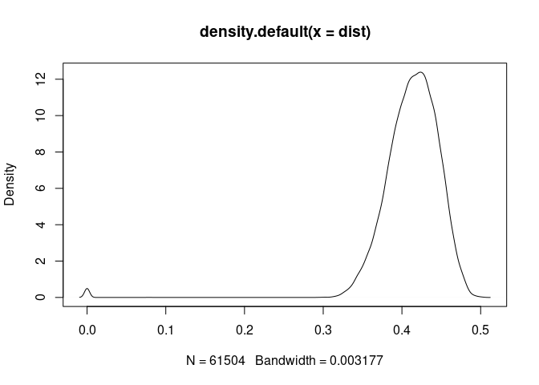
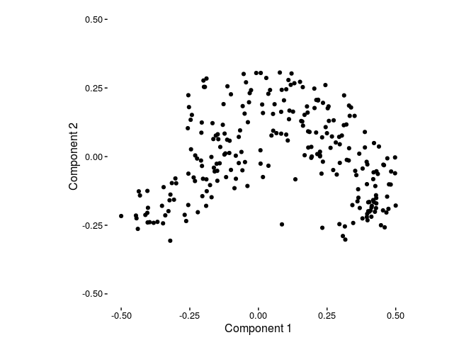
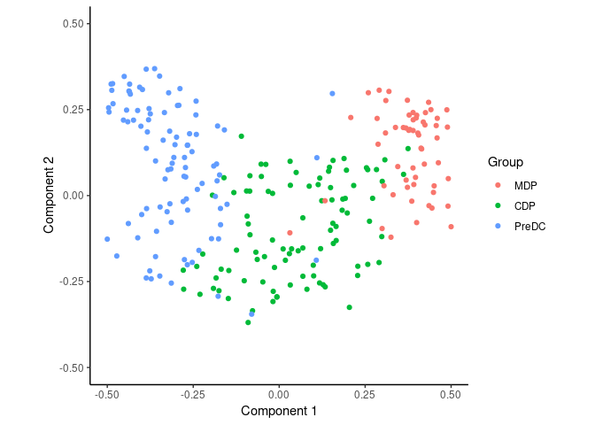
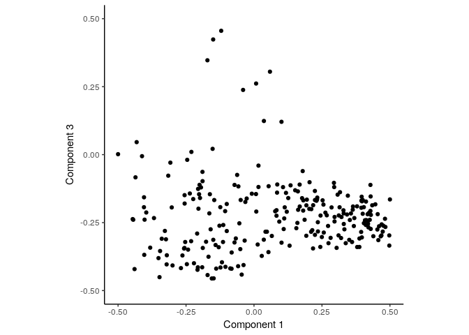
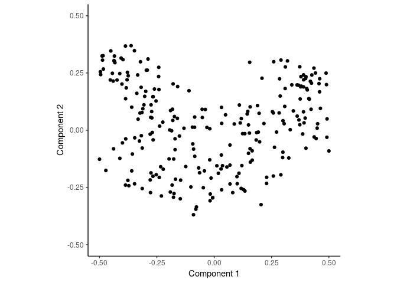
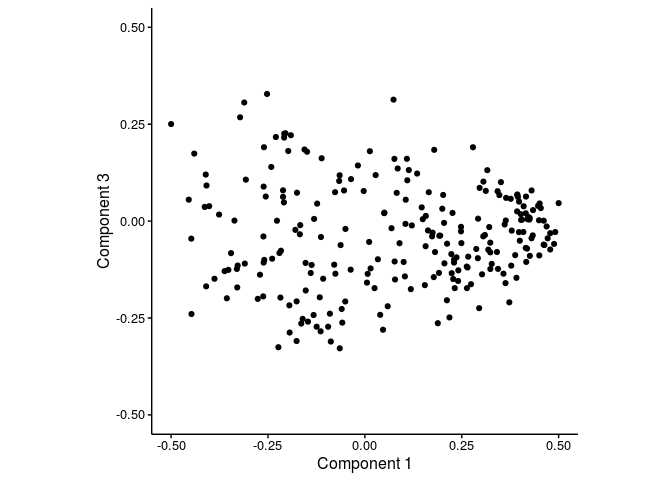
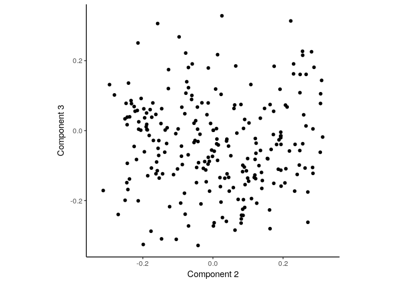
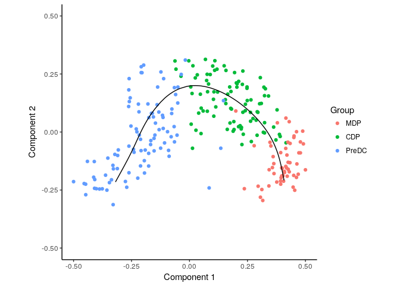

<!-- github markdown built using 
rmarkdown::render("vignettes/ginhoux.Rmd", output_format = "md_document")
rmarkdown::render("vignettes/ginhoux.Rmd", output_format = "html_document")
-->
In this vignette, SCORPIUS is used to infer a trajectory through dendritic cell progenitors. The `ginhoux` dataset contains 248 dendritic cell progenitors in one of three cellular cellular states: MDP, CDP or PreDC.

``` r
library(SCORPIUS)
data(ginhoux)
```

The dataset is a list containing a matrix named `expression` and a data frame named `sample.info`.

`expression` is a 248-by-15752 matrix containing the expression values of all the cells and all the genes.

``` r
ginhoux$expression[1:6, 1:6]
```

    ##            0610007C21Rik 0610007L01Rik 0610007P08Rik 0610007P14Rik
    ## SRR1558744      0.000000     8.3496329      0.000000      3.807342
    ## SRR1558745      2.958031     0.0000000      0.000000      5.131047
    ## SRR1558746      0.000000     0.0000000      4.248181      9.128965
    ## SRR1558747      0.000000     0.5940569      0.000000      1.365956
    ## SRR1558748      0.000000     4.5993349      0.000000      0.000000
    ## SRR1558749      0.000000     5.7900785      4.723171      6.438652
    ##            0610007P22Rik 0610009B22Rik
    ## SRR1558744             0      0.000000
    ## SRR1558745             0      3.435794
    ## SRR1558746             0      0.000000
    ## SRR1558747             0      0.000000
    ## SRR1558748             0      0.000000
    ## SRR1558749             0      8.190802

`sample.info` is a data frame with the metadata of the cells, containing cell types of the individual cells.

``` r
head(ginhoux$sample_info)
```

    ##            group_name
    ## SRR1558744        CDP
    ## SRR1558745        CDP
    ## SRR1558746        CDP
    ## SRR1558747        CDP
    ## SRR1558748        CDP
    ## SRR1558749        CDP

In order to infer a trajectory through this data, SCORPIUS first reduces the dimensionality of the dataset.

Reduce dimensionality of the dataset
------------------------------------

SCORPIUS uses classical Torgerson multi-dimensional scaling to reduce the dataset to three dimensions. In short, this technique attempts to place the cells in a space such that the distance between any two points in that space approximates the original distance between the two cells as well as possible.

The distance between any two samples is defined as their correlation distance, namely `1 - (cor(x, y)+1)/2`. The distance matrix is calculated as follows:

``` r
expression <- ginhoux$expression
group_name <- ginhoux$sample_info$group_name
dist <- correlation_distance(expression)
```

`dist` is a 248-by-248 matrix, with values ranging from 0 to 1.

``` r
dim(dist)
```

    ## [1] 248 248

``` r
plot(density(dist))
```



The reduced space is constructed as follows:

``` r
space <- reduce_dimensionality(dist)
```

The new space is a 248-by-3 matrix, and can be visualised as follows:

``` r
draw_trajectory_plot(space)
```



We can also visualise the cell types as colours as follows:

``` r
draw_trajectory_plot(space, progression_group = group_name)
```



Outlier filtering
-----------------

Most scRNA-seq datasets contain a few outliers, and these often have a dentrimental effect on the end results.

In this case, looking at the first and third dimensions, we clearly see a few outliers.

``` r
library(ggplot2)
draw_trajectory_plot(space[, c(1, 3)]) + labs(y="Component 3")
```



We filter away a few outliers and execute the dimensionality reduction again.

``` r
filt <- outlier_filter(dist)
expression <- expression[filt, ]
group_name <- group_name[filt]
dist <- dist[filt, filt]
space <- reduce_dimensionality(dist)
```

Looking at each pairwise combination of dimensions, we see that there are no more clear outliers.

``` r
draw_trajectory_plot(space[, c(1, 2)])
```



``` r
draw_trajectory_plot(space[, c(1, 3)]) + labs(y = "Component 3")
```



``` r
draw_trajectory_plot(space[, c(2, 3)]) + labs(x = "Component 2", y = "Component 3")
```



Inferring a trajectory through the cells
----------------------------------------

The main goal of SCORPIUS is to infer a trajectory through the cells, and orden the cells according to the inferred timeline.

SCORPIUS infers a trajectory through several intermediate steps, which are all executed as follows:

``` r
traj <- infer_trajectory(space)
```

The result is a list containing the final trajectory `path` and the inferred timeline for each sample `time`.

The trajectory can be visualised with respect to the samples by passing it to `draw_trajectory_plot`:

``` r
draw_trajectory_plot(space, progression_group = group_name, path = traj$path)
```



Finding candidate marker genes
------------------------------

We search for genes whose expression is seems to be a function of the trajectory timeline that was inferred, as such genes might be good candidate marker genes for dendritic cell maturation.

``` r
gimp <- gene_importances(expression, traj$time, num_permutations = 0, num_threads = 8)
gene_sel <- gimp[1:50,]
expr_sel <- expression[,gene_sel$gene]
```

To visualise the expression of the selected genes, use the `draw_trajectory_heatmap` function.

``` r
draw_trajectory_heatmap(expr_sel, traj$time, group_name)
```


Finally, these genes can also be grouped into modules as follows:

``` r
modules <- extract_modules(quant_scale(expr_sel), traj$time)
```

    ## fitting ...
    ## 
      |                                                                       
      |                                                                 |   0%
      |                                                                       
      |=                                                                |   2%
      |                                                                       
      |==                                                               |   4%
      |                                                                       
      |====                                                             |   5%
      |                                                                       
      |=====                                                            |   7%
      |                                                                       
      |======                                                           |   9%
      |                                                                       
      |=======                                                          |  11%
      |                                                                       
      |========                                                         |  13%
      |                                                                       
      |=========                                                        |  15%
      |                                                                       
      |===========                                                      |  16%
      |                                                                       
      |============                                                     |  18%
      |                                                                       
      |=============                                                    |  20%
      |                                                                       
      |==============                                                   |  22%
      |                                                                       
      |===============                                                  |  24%
      |                                                                       
      |=================                                                |  25%
      |                                                                       
      |==================                                               |  27%
      |                                                                       
      |===================                                              |  29%
      |                                                                       
      |====================                                             |  31%
      |                                                                       
      |=====================                                            |  33%
      |                                                                       
      |======================                                           |  35%
      |                                                                       
      |========================                                         |  36%
      |                                                                       
      |=========================                                        |  38%
      |                                                                       
      |==========================                                       |  40%
      |                                                                       
      |===========================                                      |  42%
      |                                                                       
      |============================                                     |  44%
      |                                                                       
      |==============================                                   |  45%
      |                                                                       
      |===============================                                  |  47%
      |                                                                       
      |================================                                 |  49%
      |                                                                       
      |=================================                                |  51%
      |                                                                       
      |==================================                               |  53%
      |                                                                       
      |===================================                              |  55%
      |                                                                       
      |=====================================                            |  56%
      |                                                                       
      |======================================                           |  58%
      |                                                                       
      |=======================================                          |  60%
      |                                                                       
      |========================================                         |  62%
      |                                                                       
      |=========================================                        |  64%
      |                                                                       
      |===========================================                      |  65%
      |                                                                       
      |============================================                     |  67%
      |                                                                       
      |=============================================                    |  69%
      |                                                                       
      |==============================================                   |  71%
      |                                                                       
      |===============================================                  |  73%
      |                                                                       
      |================================================                 |  75%
      |                                                                       
      |==================================================               |  76%
      |                                                                       
      |===================================================              |  78%
      |                                                                       
      |====================================================             |  80%
      |                                                                       
      |=====================================================            |  82%
      |                                                                       
      |======================================================           |  84%
      |                                                                       
      |========================================================         |  85%
      |                                                                       
      |=========================================================        |  87%
      |                                                                       
      |==========================================================       |  89%
      |                                                                       
      |===========================================================      |  91%
      |                                                                       
      |============================================================     |  93%
      |                                                                       
      |=============================================================    |  95%
      |                                                                       
      |===============================================================  |  96%
      |                                                                       
      |================================================================ |  98%
      |                                                                       
      |=================================================================| 100%

``` r
draw_trajectory_heatmap(expr_sel, traj$time, group_name, modules)
```


