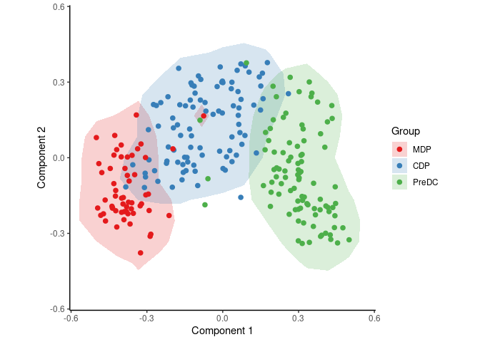
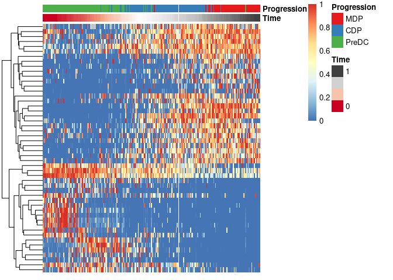
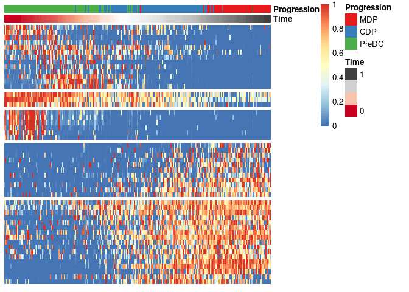

Running SCOPIUS on a Seurat object
================
Robrecht Cannoodt
2019-01-12

<!-- github markdown built using 
rmarkdown::render("vignettes/seurat.Rmd", output_format = "github_document")
-->

This vignette assumes that you have a Seurat object at the ready. As an
example, we create one from the `ginhoux` dataset containing 248
dendritic cell progenitors.

``` r
library(SCORPIUS)
library(Seurat)
data(ginhoux)

counts <- t(round(2^ginhoux$expression))
srt <- CreateSeuratObject(counts = counts, meta.data = ginhoux$sample_info)
```

## Normalise with Seurat

Seurat is used to normalise the dataset. Since the dimensionality
reduction method is scale-invariant, the scaling step in Seurat is not
required.

``` r
srt <- NormalizeData(srt)
```

Fetch the expression data from the Seurat object as follows.

``` r
expression <- t(as.matrix(srt@assays$RNA@data))
```

Also fetch some metadata from the Seurat object. Change `group_name` to
whatever column in `srt@meta.data` you are interested in.

``` r
group_name <- srt@meta.data$group_name 
```

## Reduce dimensionality of the dataset

SCORPIUS uses Torgerson multi-dimensional scaling to reduce the dataset
to three dimensions. This technique attempts to place the cells in a
space such that the distance between any two points in that space
approximates the original distance between the two cells as well as
possible.

The distance between any two samples is defined as their correlation
distance, namely `1 - (cor(x, y)+1)/2`. The reduced space is constructed
as follows:

``` r
space <- reduce_dimensionality(expression, "spearman", ndim = 3)
```

The new space is a 245-by-3 matrix, and can be visualised with or
without colouring of the different cell types.

``` r
draw_trajectory_plot(space, progression_group = group_name, contour = TRUE)
```

<!-- -->

## Inferring a trajectory through the cells

The main goal of SCORPIUS is to infer a trajectory through the cells,
and orden the cells according to the inferred timeline.

SCORPIUS infers a trajectory through several intermediate steps, which
are all executed as follows:

``` r
traj <- infer_trajectory(space)
```

The result is a list containing the final trajectory `path` and the
inferred timeline for each sample `time`.

The trajectory can be visualised with respect to the samples by passing
it to `draw_trajectory_plot`:

``` r
draw_trajectory_plot(
  space, 
  progression_group = group_name,
  path = traj$path,
  contour = TRUE
)
```

<!-- -->

## Finding candidate marker genes

We search for genes whose expression is seems to be a function of the
trajectory timeline that was inferred, as such genes might be good
candidate marker genes for dendritic cell maturation.

``` r
gimp <- gene_importances(expression, traj$time, num_permutations = 0, num_threads = 8)
gene_sel <- gimp[1:50,]
expr_sel <- expression[,gene_sel$gene]
```

To visualise the expression of the selected genes, use the
`draw_trajectory_heatmap` function.

``` r
draw_trajectory_heatmap(expr_sel, traj$time, group_name)
```

<!-- -->

Finally, these genes can also be grouped into modules as follows:

``` r
modules <- extract_modules(scale_quantile(expr_sel), traj$time, verbose = FALSE)
draw_trajectory_heatmap(expr_sel, traj$time, group_name, modules)
```

<!-- -->
