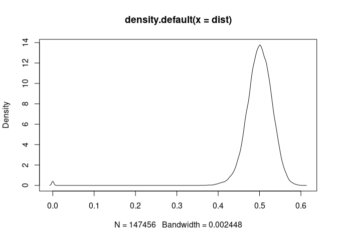
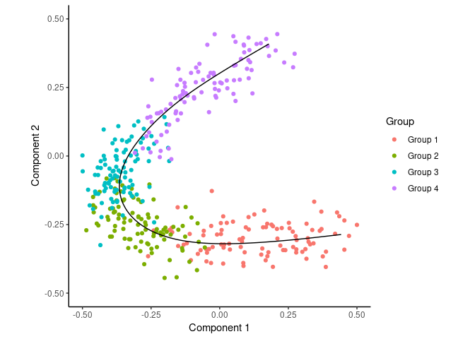
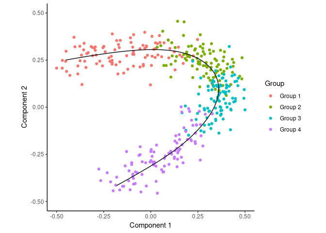

<!-- github markdown built using 
rmarkdown::render("vignettes/simulated-data.Rmd", output_format = "md_document")
rmarkdown::render("vignettes/simulated-data.Rmd", output_format = "html_document")
-->
In this vignette, SCORPIUS is used to infer a trajectory through cells in artificial single-cell RNA-seq data. Note that the dataset is generated in a very naive manner and is only meant to be used for demonstration purposes, not for evaluating trajectory inference methods.

Simulate expression data
------------------------

Expression values for 384 cells and 500 genes is generated as follows.

``` r
library(SCORPIUS)
dataset <- generate_dataset(type="poly", num_genes=500, num_samples=384, num_groups=4)
```

The resulting dataset is a list containing a matrix named `expression` and a data frame named `sample_info`.

`expression` is a 384-by-500 matrix containing the expression values of all the cells and all the genes.

``` r
dataset$expression[1:6, 1:6]
```

    ##             Gene1    Gene2    Gene3    Gene4    Gene5    Gene6
    ## Sample1 7.0888310 0.000000 0.000000 2.038639 0.000000 5.131362
    ## Sample2 6.2477708 0.000000 0.915955 0.000000 6.420908 5.834446
    ## Sample3 9.2618226 3.943155 0.000000 2.077188 6.481860 6.450960
    ## Sample4 6.5399238 4.318685 0.000000 5.943639 1.025464 4.386607
    ## Sample5 0.8599413 7.037318 0.000000 4.289563 0.000000 2.973694
    ## Sample6 3.9560420 0.000000 6.246375 0.000000 4.308269 4.198609

`sample_info` is a data frame with the metadata of the cells, containing only the group each cell belongs to.

``` r
head(dataset$sample_info)
```

    ##         group_name
    ## Sample1    Group 1
    ## Sample2    Group 1
    ## Sample3    Group 1
    ## Sample4    Group 1
    ## Sample5    Group 1
    ## Sample6    Group 1

In order to infer a trajectory through this data, SCORPIUS first reduces the dimensionality of the dataset.

Reduce dimensionality of the dataset
------------------------------------

SCORPIUS uses classical Torgerson multi-dimensional scaling to reduce the dataset to three dimensions. In short, this technique attempts to place the cells in a space such that the distance between any two points in that space approximates the original distance between the two cells as well as possible.

The distance between any two samples is defined as their correlation distance, namely `1 - (cor(x, y)+1)/2`. The distance matrix is calculated as follows:

``` r
expression <- dataset$expression
group_name <- dataset$sample_info$group_name
dist <- correlation_distance(expression)
```

`dist` is a 384-by-384 matrix, with values ranging from 0 to 1.

``` r
dim(dist)
```

    ## [1] 384 384

``` r
plot(density(dist))
```



The reduced space is constructed as follows:

``` r
space <- reduce_dimensionality(dist)
```

The new space is a 384-by-3 matrix, and can be visualised as follows:

``` r
draw_trajectory_plot(space)
```


Looking at this plot, it seems that the cells in this dataset are involved in a dynamic process.

In addition, if a property of the cells (e.g. cell type) is known, it can be used to colour the plot using the `progression_group` parameter.

In this case, the underlying groups of each cell were also given:

``` r
draw_trajectory_plot(space, progression_group = group_name)
```



Inferring a trajectory through the cells
----------------------------------------

The main goal of SCORPIUS is to infer a trajectory through the cells, and orden the cells according to the inferred timeline.

SCORPIUS infers a trajectory through several intermediate steps, which are all executed as follows:

``` r
traj <- infer_trajectory(space)
```

The result is a list containing the final trajectory `path` and the inferred timeline for each sample `time`.

The trajectory can be visualised with respect to the samples by passing it to `draw_trajectory_plot`:

``` r
draw_trajectory_plot(space, progression_group = group_name, path = traj$path)
```



Finding candidate marker genes
------------------------------

We search for genes whose expression is seems to be a function of the trajectory timeline that was inferred, as such genes might be good candidate marker genes for the dynamic process that is being investigated.

``` r
gimp <- gene_importances(expression, traj$time, num_permutations = 0, num_threads = 8)
gene_sel <- gimp[1:50,]
expr_sel <- expression[,gene_sel$gene]
```

To visualise the expression of the selected genes, use the `draw_trajectory_heatmap` function.

``` r
draw_trajectory_heatmap(expr_sel, traj$time, group_name)
```


Finally, these genes can also be grouped into modules as follows:

``` r
modules <- extract_modules(scale_quantile(expr_sel), traj$time)
```

``` r
draw_trajectory_heatmap(expr_sel, traj$time, group_name, modules)
```


