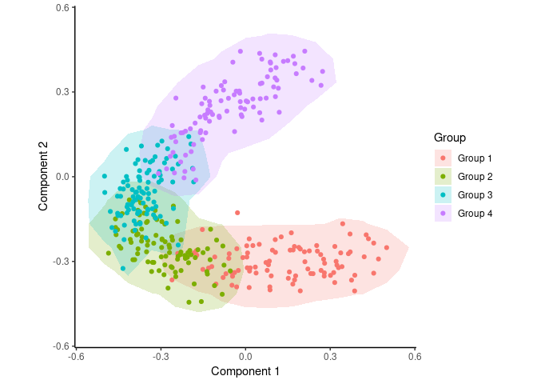
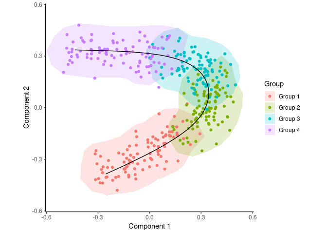
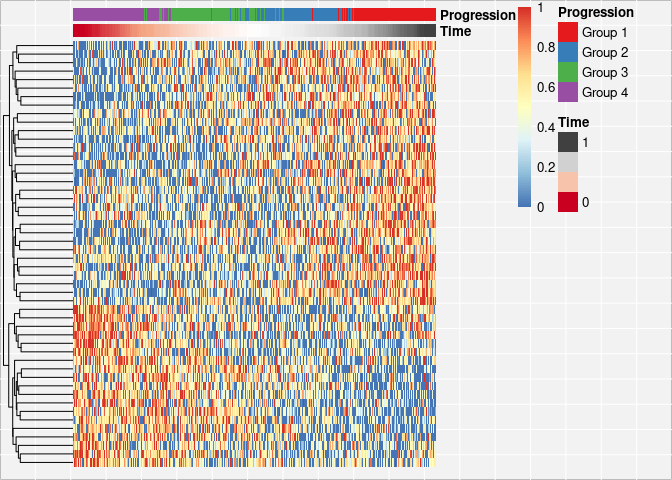
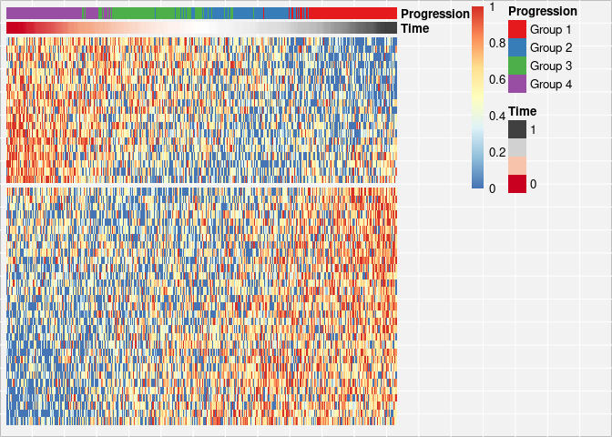

Trajectory inference from simulated data
================
Robrecht Cannoodt
2016-01-22

<!-- github markdown built using 
rmarkdown::render("vignettes/simulated-data.Rmd", output_format = "github_document")
-->
In this vignette, SCORPIUS is used to infer a trajectory through cells in artificial single-cell RNA-seq data. Note that the dataset is generated in a very naive manner and is only meant to be used for demonstration purposes, not for evaluating trajectory inference methods.

Simulate expression data
------------------------

Expression values for 384 cells and 500 genes is generated as follows.

``` r
library(SCORPIUS)
dataset <- generate_dataset(type = "poly", num_genes = 500, num_samples = 384, num_groups = 4)
```

The resulting dataset is a list containing a matrix named `expression` and a data frame named `sample_info`.

`expression` is a 384-by-500 matrix containing the expression values of all the cells and all the genes.

``` r
dataset$expression[1:6, 1:6]
```

    ##             Gene1     Gene2     Gene3    Gene4     Gene5     Gene6
    ## Sample1  4.229293  0.000000  6.752726 2.911327  9.116873  7.968772
    ## Sample2 12.063623  6.101313  0.000000 8.023840  6.612786  0.000000
    ## Sample3  7.973086 12.969934 10.412038 5.564873 10.258806  0.000000
    ## Sample4  0.000000 10.665796  7.329762 4.635637  9.743435  5.462945
    ## Sample5  8.467850 12.182375  5.609669 0.000000  7.102293  7.985970
    ## Sample6  9.269898  9.630904 10.455783 0.000000  8.349845 13.157807

`sample_info` is a data frame with the metadata of the cells, containing only the group each cell belongs to.

``` r
head(dataset$sample_info)
```

    ##         group_name
    ## Sample1    Group 1
    ## Sample2    Group 1
    ## Sample3    Group 1
    ## Sample4    Group 1
    ## Sample5    Group 1
    ## Sample6    Group 1

In order to infer a trajectory through this data, SCORPIUS first reduces the dimensionality of the dataset.

Reduce dimensionality of the dataset
------------------------------------

SCORPIUS uses Torgerson multi-dimensional scaling to reduce the dataset to three dimensions. This technique attempts to place the cells in a space such that the distance between any two points in that space approximates the original distance between the two cells as well as possible.

The distance between any two samples is defined as their correlation distance, namely `1 - (cor(x, y)+1)/2`. The reduced space is constructed as follows:

``` r
expression <- dataset$expression
group_name <- dataset$sample_info$group_name
space <- reduce_dimensionality(expression, correlation_distance, ndim = 3)
```

The new space is a 384-by-3 matrix, and can be visualised with or without colouring of the different cell types.

``` r
draw_trajectory_plot(space, progression_group = group_name, contour = TRUE)
```



Inferring a trajectory through the cells
----------------------------------------

The main goal of SCORPIUS is to infer a trajectory through the cells, and orden the cells according to the inferred timeline.

SCORPIUS infers a trajectory through several intermediate steps, which are all executed as follows:

``` r
traj <- infer_trajectory(space)
```

The result is a list containing the final trajectory `path` and the inferred timeline for each sample `time`.

The trajectory can be visualised with respect to the samples by passing it to `draw_trajectory_plot`:

``` r
draw_trajectory_plot(
  space, 
  progression_group = group_name,
  path = traj$path,
  contour = TRUE
)
```



Finding candidate marker genes
------------------------------

We search for genes whose expression is seems to be a function of the trajectory timeline that was inferred, as such genes might be good candidate marker genes for the dynamic process that is being investigated.

``` r
gimp <- gene_importances(expression, traj$time, num_permutations = 0, num_threads = 8)
gene_sel <- gimp[1:50,]
expr_sel <- expression[,gene_sel$gene]
```

To visualise the expression of the selected genes, use the `draw_trajectory_heatmap` function.

``` r
draw_trajectory_heatmap(expr_sel, traj$time, group_name)
```



Finally, these genes can also be grouped into modules as follows:

``` r
modules <- extract_modules(scale_quantile(expr_sel), traj$time, verbose = FALSE)
draw_trajectory_heatmap(expr_sel, traj$time, group_name, modules)
```


